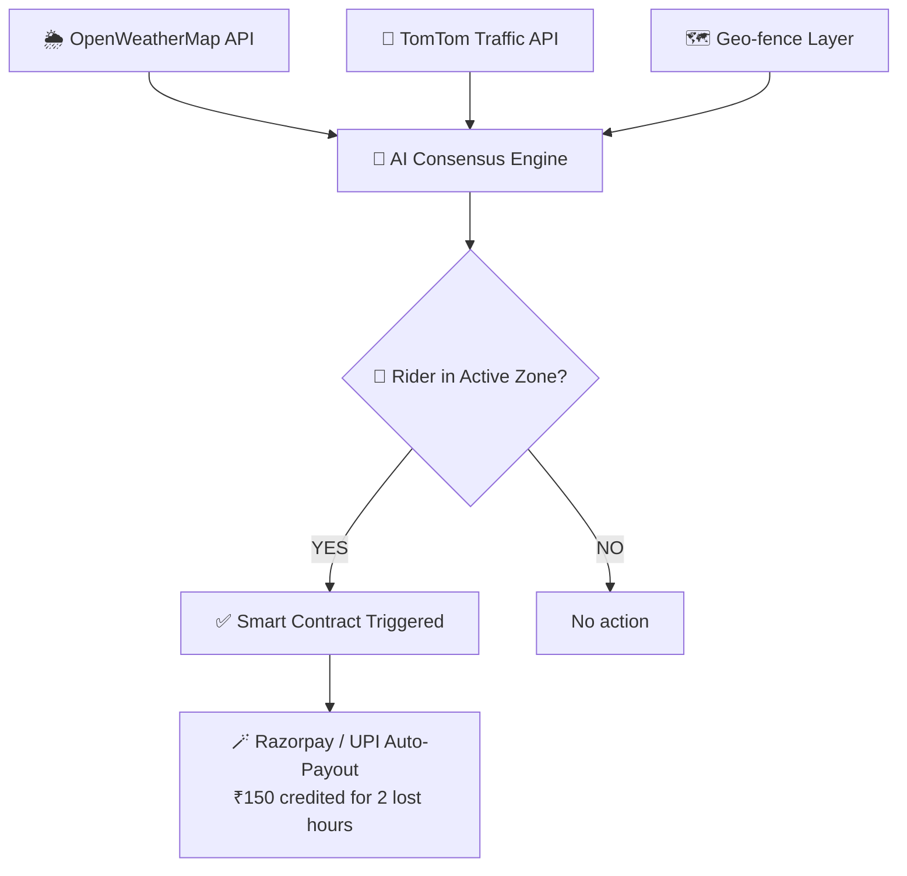

<div align="center">
  
</div>

> **AI-Powered Parametric Insurance for Q-Commerce Delivery Partners**
> *When the rain stops your ride, DropSure covers your side.*

<br/>

[](https://github.com)
[](https://github.com)
[](LICENSE)
[](CONTRIBUTING.md)

<br/>

```
⚡ No Claims.  🤖 No Forms.  💸 Automatic Payouts.  🌧️ Weather-Triggered.
```

</div>

---

## 📖 Table of Contents

- [🌧️ The Problem](#️-the-problem)
- [💡 Our Solution](#-our-solution)
- [🚀 What Makes Us Different](#-what-makes-us-different)
- [⚙️ How It Works](#️-how-it-works)
- [🧠 Core Features](#-core-features)
- [🛠️ Tech Stack](#️-tech-stack)
- [📱 Platform Architecture](#-platform-architecture)
- [📈 Scalability](#-scalability)
- [🗓️ Roadmap](#️-roadmap)
- [✅ Hackathon Compliance](#-hackathon-compliance)
- [👥 Team](#-team)
- [🔗 Links](#-links)

---

## 🌧️ The Problem

<div align="center">

```
India's Q-Commerce riders power the 10-minute economy.
But when it rains, they lose. When roads close, they lose.
When AQI spikes past 450, they lose.

And currently? They bear 100% of that loss alone.
```

</div>

India's **Quick Commerce (Q-Commerce)** delivery partners operate under brutal constraints:

| Disruption Type | Trigger | Rider Impact |
|---|---|---|
| 🌧️ Sudden Cloudburst | Localized rainfall > 15mm/hr | Zone paused, 0 orders |
| ☁️ Severe AQI Spike | Air Quality Index > 450 | Forced off road |
| 🚧 Route/Road Closure | Strike, accident, waterlogging | Dark store inaccessible |
| ⛔ Platform Zone Pause | Any external disruption | **20–30% daily wage lost** |

> **Traditional insurance** covers accidents and health — not daily livelihood.
> **Zero safety net** exists for gig workers facing environmental or civic disruptions.

---

## 💡 Our Solution

<div align="center">

### 🛡️ DropSure — Micro-Parametric Income Protection

*We don't wait for you to file a claim. We pay you before you even think about it.*

</div>

DropSure is a **fully automated parametric insurance platform** that:

- 📡 **Monitors** hyper-local weather, traffic, and municipal APIs in real-time
- 📍 **Geo-fences** the exact 2km radius dark-store zone a rider is working in
- ⚡ **Triggers** automatic payouts the moment a parametric threshold is crossed
- 💸 **Pays** directly to the rider's UPI wallet — **zero forms, zero waiting**

---

## 🚀 What Makes Us Different

```
Traditional Insurance          DropSure
─────────────────────          ────────────────────────────
File a claim manually    →     No claim needed — ever
Wait days for review     →     Payout in minutes
Prove your losses        →     Data proves it for you
Annual premium cycle     →     Weekly micro-premiums (₹25–₹45)
Covers accidents/health  →     Covers lost earning hours
City-level risk model    →     Block-level hyper-local precision
```

<div align="center">

### The DropSure Flip: **Event-Driven, Not Claim-Driven**

</div>

---

## ⚙️ How It Works

## DropSure Engine — Flow Diagram

### Trigger Conditions (AND Logic)

A payout fires **only when ALL of the following are true:**

- ☔ `OpenWeather API: Rainfall > 15mm/hr` **AND**
- 🐢 `TomTom API: Avg Speed < 5km/h for > 60 mins` **AND**
- 📍 `Rider GPS: Inside active disrupted geo-fence`

---

## 🧠 Core Features

### 1. 🤖 AI-Powered Dynamic Weekly Premium

Our ML model recalculates **every Sunday night** based on:

```python
premium = model.predict([
    weather_forecast_7day,      # Upcoming week's rain/AQI forecast
    historical_disruption_rate, # Past disruptions at rider's dark store
    rider_tier_and_rating,      # Experience & reliability score
])

# Clear week  → ₹20/week
# Monsoon week → ₹45/week
```

**Fair. Dynamic. Data-backed.**

---

### 2. ⚡ Parametric Automation & Zero-Touch Claims

```
Rider logs in → Zone disrupted → APIs confirm → Payout sent
      ↑                                              ↓
      └──────── No human intervention needed ────────┘
```

- No claims portal
- No approval queue
- No paperwork
- Just ₹ in your wallet

---

### 3. 🔒 Intelligent Fraud Detection

| Method | What It Prevents |
|---|---|
| 📡 Device-Level GPS Telemetry | Riders spoofing location into a storm zone |
| 🔁 Multi-API Consensus Check | False positives from a single faulty sensor |
| ⏱️ Zone Entry Timestamp | Must be inside zone *before* disruption starts |

---

## 🛠️ Tech Stack

<div align="center">

### Frontend

[](https://react.dev)
[](https://flutter.dev)
[](https://typescriptlang.org)
[](https://tailwindcss.com)

### Backend

[](https://nodejs.org)
[](https://expressjs.com)
[](https://python.org)
[](https://fastapi.tiangolo.com)

### Database

[](https://postgresql.org)
[](https://mongodb.com)
[](https://redis.io)

### AI / ML

[](https://python.org)
[](https://tensorflow.org)
[](https://scikit-learn.org)

### DevOps & Cloud

[](https://docker.com)
[](https://cloud.google.com)
[](https://github.com)
[](https://github.com/features/actions)

</div>

---

### 🔌 External API Integrations

| Category | Provider | Purpose |
|---|---|---|
| 🌦️ Weather | OpenWeatherMap / Tomorrow.io | Real-time rainfall & AQI data |
| 🚗 Traffic | TomTom Traffic API / Mapbox | Road speed & congestion monitoring |
| 💳 Payments | Razorpay (Test Env) / Mock UPI | Automated micro-payouts |
| 📍 Location | Google Maps / Mapbox | Geo-fence creation & GPS validation |

---

## 📱 Platform Architecture

**Mobile-First Progressive Web App (PWA)**

```
Why PWA over Native App?

✅ No App Store dependency or approval wait
✅ Instant updates without user action
✅ Minimal data consumption (critical for 2G/3G users)
✅ Works on any Android/iOS device
✅ Seamlessly links to UPI & delivery apps
✅ Offline-capable for low-connectivity areas
```

**Rider Journey in the App:**

```
1. Sign Up (Aadhaar + Platform ID)
   ↓
2. Choose Weekly Plan (shown dynamically every Sunday)
   ↓
3. Premium deducted from weekly platform payout
   ↓
4. Work normally — DropSure watches in the background
   ↓
5. Disruption detected? → ₹ credited automatically
   ↓
6. View earnings protection history in dashboard
```

---

## 📈 Scalability

DropSure is **intrinsically horizontal**:

```
Add a new city?     → Map new geo-fences + pull city APIs
Add a new persona?  → Adjust ML weights for ride-hailing / food delivery
Add a new trigger?  → Plug in new API (AQI, flood sensors, traffic cameras)

Core parametric engine stays identical. 🔁
```

| Metric | Phase 1 | 6-Month Target |
|---|---|---|
| Cities | 1 (Bangalore) | 5 (Metro cities) |
| Riders | Mock/Demo | 10,000+ |
| Trigger Types | Rain + Traffic | Rain, AQI, Floods, Strikes |
| Payout Latency | < 5 min | < 2 min |

---

## 🗓️ Roadmap

```
Phase 1 — Weeks 1-2 (COMPLETE ✅)
├── Problem research & validation
├── Architecture design
├── Hackathon proposal submission
└── Tech stack finalization

```

---

## ✅ Hackathon Compliance

| Constraint | Status | Details |
|---|---|---|
| 💰 Loss of Income Only | ✅ Compliant | Strictly compensates hourly wages lost due to API-verified disruptions. Zero coverage for vehicles, accidents, health, or life. |
| 📅 Weekly Pricing Model | ✅ Compliant | 7-day rolling premium cycle, auto-deducted from weekly platform payout. |
| 🎯 Persona Focus | ✅ Compliant | Exclusively designed for Q-Commerce delivery partners (Zepto / Blinkit / Instamart). |
| 🤖 AI Integration | ✅ Compliant | AI used for dynamic risk pricing (XGBoost/Scikit-learn) and fraud detection (telemetry validation). |

---

## 👥 Team

<div align="center">

| Role | Responsibilities |
|---|---|
| 🧑‍💼 Product Lead | Research, UX design, compliance |
| 🧑‍💻 Backend Engineer | Node.js engine, API integrations |
| 👩‍🔬 ML Engineer | Risk model, premium pricing algorithm |
| 🎨 Frontend Developer | PWA/Flutter UI, dashboard |

> *Built with ❤️ for India's gig workers by Team [Your Team Name]*

</div>

---

## 🔗 Links

<div align="center">

| Resource | Link |
|---|---|
| 🎬 Phase 1 Pitch Video (2 min) | [▶️ Watch on YouTube / Drive](https://drive.google.com/file/d/119CgHxI2WwaYCkCc-N-LzdhcFKmO2mH2/view?usp=drivesdk) |
| 💻 GitHub Repository | [🔗 View Code](https://github.com/TechWithDipak/AI-Powered-Insurance-for-India-s-Gig-Economy) |
| 🌐 Live Demo (PWA) | [🚀 Try DropSure](https://ai-powered-insurance-for-india-s-gi.vercel.app/) |

</div>

---

<div align="center">

```
🌧️  Rain falls.  Roads flood.  Riders lose.
💸  DropSure pays.  Automatically.  Instantly.  Always.
```

<br/>

**Built for Guidewire DEVTrails 2026**

*DropSure — Because every hour of work deserves protection.*

